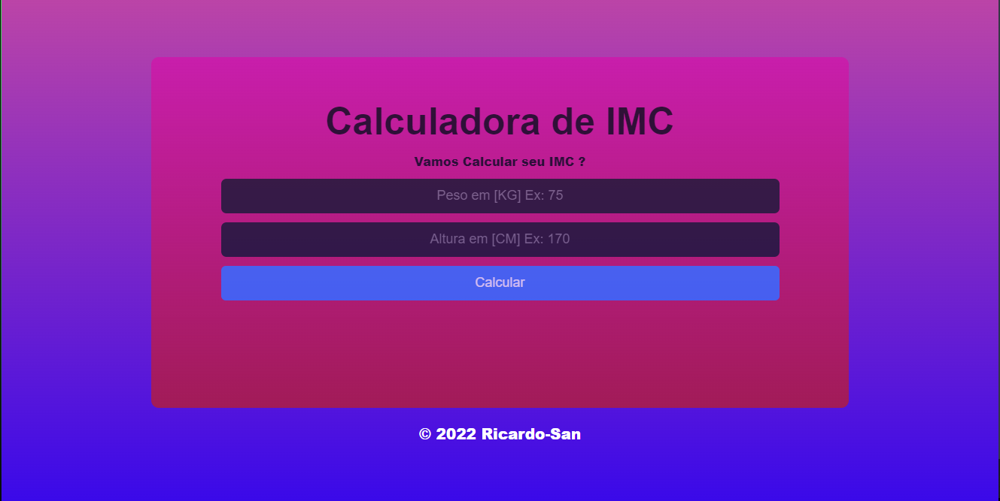

<h1 align="center">Calculadora De IMC</h1>
<h2 align="center">Calculadora de IMC, projeto simples, mas com o intuito de dar continuidade aos estudos com React e os conceitos  de variaveis de estado/Hooks e também os conceitos de responsividade !</h2>

 
 

    <h3>Tecnologias utilizadas: 
    
    
    
    </h3>

 
 

    <h1 align="center">Site com a tela interia</h1>
    

##
 
 

  <h1>Click aqui para acessar o site hospedado na Vercel: <a href="https://calculadora-imc-ricardosantanaevangelista.vercel.app">Site</a></h1>
  

  
